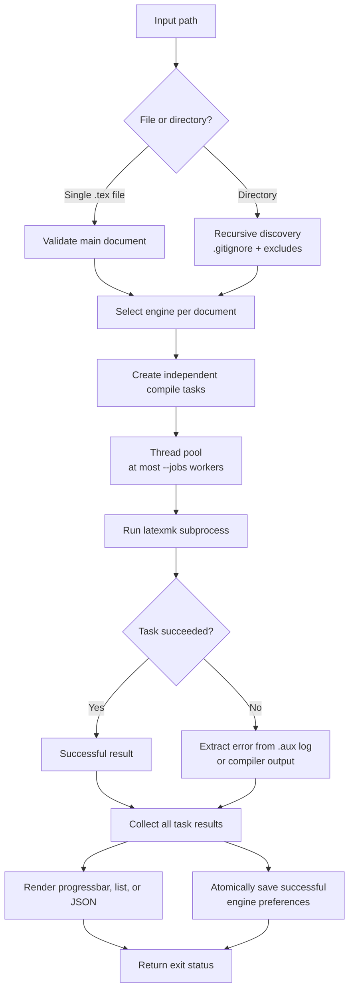
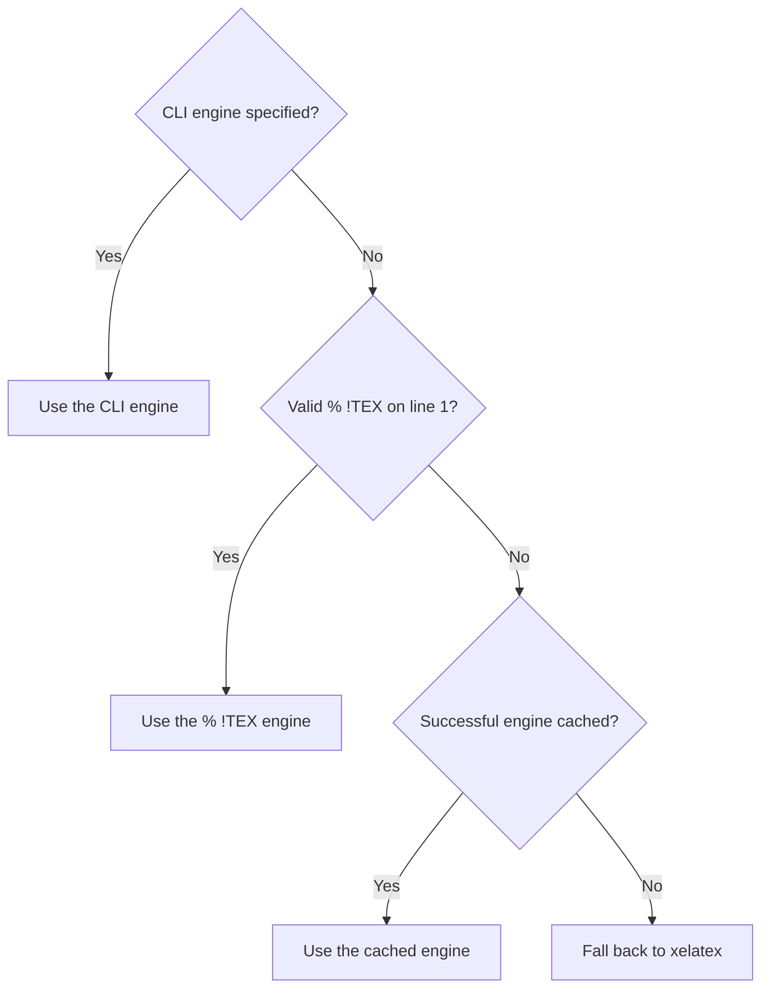

# auto-latexmk

> 🚀 One command to discover, plan, and compile every main LaTeX document in a
> project.

`auto-latexmk` is a one-shot command-line tool for compiling LaTeX projects.
Give it a `.tex` file or a directory: it finds main documents, selects an
engine for each one, runs `latexmk`, and reports all results in a human- or
machine-readable form.

It is designed for repositories that contain several independent LaTeX
documents. It does not watch files or run as a background service; every
invocation performs one scan and one compilation batch.

**One-shot compilation** · **Per-file engine selection** · **Parallel jobs** ·
**Human and JSON output**

## ✨ Features

- 🔎 Compile one main `.tex` file or recursively compile every main document in a
  directory.
- 🧠 Select XeLaTeX, pdfLaTeX, or LuaLaTeX per document.
- ⚡ Run several independent compilations concurrently, or use one job for
  sequential execution.
- 🙈 Respect nested `.gitignore` files during directory scans.
- 🎯 Exclude files or directories with repeatable filename patterns.
- 🗂️ Keep auxiliary files in a local `.aux/` directory while writing PDFs next to
  their source files.
- 📊 Report progress as a compact progress bar, stable lines, or structured JSON.
- 🐛 Save detailed compiler diagnostics to an independent debug log.
- 💾 Remember the last successful engine used for each document.
- ⏱️ Stop non-interactively on LaTeX errors and enforce a per-file timeout.

## 📦 Requirements

- Python 3.11 or newer.
- `latexmk` available on `PATH`.
- A LaTeX distribution containing the engines you intend to use, such as TeX
  Live.

`auto-latexmk` delegates dependency tracking, bibliography runs, index
generation, and rerun decisions to `latexmk`; it does not implement a TeX build
system itself.

## 🚀 Installation

Install the current Git version with `uv`:

```bash
uv tool install git+ssh://git@github.com/fenglielie/auto-latexmk.git@main

# or over HTTPS
uv tool install git+https://github.com/fenglielie/auto-latexmk.git@main
```

For local development:

```bash
uv tool install -e .
```

Verify the installation:

```bash
auto-latexmk --version
auto-latexmk --help
```

## ⚡ Quick start

```bash
# Find and compile all main documents under the current directory
auto-latexmk

# Compile one document
auto-latexmk main.tex

# Inspect the planned tasks without compiling
auto-latexmk --dry-run

# Compile with two concurrent jobs
auto-latexmk -j 2 .

# Compile sequentially
auto-latexmk -j 1 .

# Force pdfLaTeX for every discovered document
auto-latexmk -pdf .
```

For a directory input, a file is considered a main document when its
uncommented source contains `\documentclass`. Included fragments without a
document class are skipped. Passing a file directly still requires it to be a
main `.tex` document.

## ⚙️ How it works

Each invocation follows the same one-shot pipeline:



### 1. Document discovery

With a directory input, `auto-latexmk` walks the directory recursively.

- Hidden directories, `.git/`, and `.aux/` are not traversed.
- `.gitignore` rules are applied by default, including rules from nested
  `.gitignore` files.
- `-x/--exclude` patterns are matched against individual directory and `.tex`
  filenames. Repeat the option to supply multiple patterns.
- Only `.tex` files containing an uncommented `\documentclass` declaration
  become compile tasks.

An explicitly supplied `.tex` file is compiled even if it is ignored by a
`.gitignore` file. Use `--no-gitignore` when a directory scan should include
Git-ignored paths.

### 2. Engine selection

The engine is selected independently for every task, in this order:

1. A command-line engine flag: `-pdfxe`, `-pdf`, or `-pdflua`.
2. A `% !TEX` directive on the first line.
3. The last successful engine stored in the compiler preference cache.



An explicit command-line option is a force override. When one is present,
`auto-latexmk` does not inspect `% !TEX` and does not read the compiler
preference cache. If none of the three selectors provides an engine, XeLaTeX
is used as the fixed fallback:

```tex
% !TEX program = lualatex
\documentclass{article}
```

The example above uses LuaLaTeX normally, but `auto-latexmk -pdf main.tex`
forces pdfLaTeX.

### 3. Task execution

Every task runs `latexmk` in the source file's directory with a fixed,
non-interactive command equivalent to:

```text
latexmk -file-line-error -halt-on-error -interaction=nonstopmode -synctex=1 \
  -pdfxe "-auxdir=/path/to/project/.aux" \
  "-outdir=/path/to/project" "/path/to/project/main.tex"
```

The engine flag changes to `-pdf` for pdfLaTeX or `-pdflua` for LuaLaTeX.
Running the process from the source directory keeps relative `\input`,
`\includegraphics`, bibliography, and configuration paths working as expected.

Generated files are separated as follows:

- PDF and SyncTeX output: next to the source `.tex` file.
- LaTeX auxiliary and log files: `.aux/` next to the source `.tex` file.

Tasks are submitted to a thread pool. The default concurrency is
`min(4, CPU count)`; `-j 1` uses the same scheduler with one worker. A failed
task does not prevent the remaining independent tasks from finishing.

Each task has its own timeout, which defaults to 180 seconds. Ctrl+C terminates
active `latexmk` processes and returns exit status 130.

### 4. Error reporting

When a compilation fails, `auto-latexmk` first looks for the corresponding log
under `.aux/`. It reports the first recognizable LaTeX error block, falling
back to the tail of the log or compiler output when necessary.

The progress-bar and list modes show all failed task details after the batch
finishes. Full compiler output is available through `--debug-log`.

### 5. Compiler preference cache

After a successful compilation, the selected engine is stored by absolute
source path in:

```text
~/.cache/auto-latexmk/compiler-preferences.json
```

The cache is merged and written atomically with process-local and
cross-process locking. Failed compilations do not update it. Explicit engine
flags have the highest priority, followed by `% !TEX`, then the cached value.

Use `--no-cache-pref` for reproducible runs that should not read or write these
preferences.

## 📖 Command-line reference

```text
auto-latexmk [-h] [--output-mode {progressbar,list,json}]
             [-pdfxe | -pdf | -pdflua] [--debug-log FILE]
             [--no-color] [--dry-run]
             [-c] [--no-compile] [-j N]
             [--timeout SECONDS] [-x PATTERN]
             [--no-gitignore] [--no-cache-pref] [-v] [PATH]
```

| Option                            | Description                                                                                    |
| --------------------------------- | ---------------------------------------------------------------------------------------------- |
| `PATH`                            | Directory to scan recursively, or one `.tex` file; defaults to the current directory           |
| `-h`, `--help`                    | Show help and exit                                                                             |
| `--output-mode MODE`              | Console output: `progressbar`, `list`, or `json`; defaults to `progressbar`                    |
| `-pdfxe`                          | Force XeLaTeX for every discovered document                                                    |
| `-pdf`                            | Force pdfLaTeX for every discovered document                                                   |
| `-pdflua`                         | Force LuaLaTeX for every discovered document                                                   |
| `--debug-log FILE`                | Overwrite `FILE` with detailed diagnostics and complete compiler output                        |
| `--no-color`                      | Disable colored terminal output                                                                |
| `--dry-run`                       | Discover and display tasks without cleaning or compiling                                       |
| `-c`, `--pre-clean`               | Delete applicable `.aux/` directories before compiling                                         |
| `--no-compile`                    | Skip compilation; primarily useful with `--pre-clean`                                          |
| `-j N`, `--jobs N`                | Maximum concurrent tasks; `1` is sequential; defaults to `min(4, CPU count)`                   |
| `--timeout SECONDS`               | Per-file compilation timeout; defaults to `180`                                                |
| `-x PATTERN`, `--exclude PATTERN` | Exclude a matching directory or `.tex` filename; repeat for multiple fnmatch patterns          |
| `--no-gitignore`                  | Ignore `.gitignore` rules during directory discovery                                           |
| `--no-cache-pref`                 | Disable reading and writing the compiler preference cache                                      |
| `-v`, `--version`                 | Print the installed version and exit                                                           |

`--jobs` and `--timeout` must both be positive integers. The three engine
options are mutually exclusive.

## 🧰 Common workflows

### Clean before compiling

```bash
auto-latexmk -c .
```

Pre-clean removes `.aux/` directories under the input path before task
discovery. It skips hidden directories and honors `--exclude` patterns. It does
not apply `.gitignore` rules to cleaning.

Clean without compiling:

```bash
auto-latexmk -c --no-compile .
```

### Exclude generated or unrelated documents

```bash
auto-latexmk -x 'ref*' -x '*-draft.tex' .
```

Patterns use Python `fnmatch` syntax and match individual basenames rather than
full relative paths.

### Disable cached engine selection

```bash
auto-latexmk --no-cache-pref .
```

This is useful in CI, where engine selection should depend only on the source,
the command line, and the XeLaTeX fallback.

### Capture diagnostics

```bash
auto-latexmk --debug-log auto-latexmk-debug.log .
```

The debug log is an independent channel and does not change the selected
console output mode. It is overwritten on every invocation.

## 🖥️ Output modes

### `progressbar`

The default mode writes a compact `tqdm` progress bar to stderr:

```text
Compile 29/29 |████████████████████| 100% [00:05] 4 jobs 28 OK, 1 FAILED
```

The job count is omitted when `--jobs=1`. Success and failure counts update as
tasks finish.

### `list`

List mode writes one stable completion line per task to stderr, followed by a
summary:

```text
[ 1/29] OK     /project/notes-a.tex (xelatex) (0.61s)
[ 2/29] FAILED /project/notes-b.tex (pdflatex) (0.72s)
Compiled 29 file(s) in 5.68s: 28 succeeded, 1 failed
```

Because tasks may run concurrently, completion lines are emitted in completion
order rather than discovery order.

### `json`

JSON mode writes one JSON document to stdout and does not emit interactive
progress. This makes it suitable for scripts:

```bash
auto-latexmk --output-mode json . > result.json
```

Successful and failed task results share this top-level structure:

```json
{
  "schema_version": 1,
  "status": "succeeded",
  "elapsed_time": 1.234,
  "summary": {
    "total": 1,
    "succeeded": 1,
    "failed": 0
  },
  "tasks": [
    {
      "index": 1,
      "path": "/project/main.tex",
      "engine": "xelatex",
      "status": "succeeded",
      "elapsed_time": 1.2
    }
  ]
}
```

Failed tasks may additionally contain `error` and `log_file`. Dry runs use
`status: "dry-run"` and mark each task as `planned`. CLI syntax errors are
handled by `argparse`, which writes usage information to stderr and exits with
status 2 before a JSON reporter is created.

## 🚦 Exit status

| Code  | Meaning                                                     |
| ----- | ----------------------------------------------------------- |
| `0`   | All tasks succeeded, a dry run completed, or compile was skipped |
| `1`   | Discovery, cleaning, setup, or at least one compilation failed   |
| `2`   | Invalid command-line usage                                  |
| `130` | Interrupted by Ctrl+C                                       |

## 🛠️ Development

Create or update the local environment:

```bash
uv sync
```

Run the unit tests:

```bash
uv run python -m unittest discover -s tests
```

Static and packaging checks used by the project:

```bash
uvx ruff check src tests
uvx pyright --pythonpath .venv/Scripts/python.exe src tests  # Windows
uv lock --check
uv build
```

On Linux or macOS, use `.venv/bin/python` for the Pyright Python path.
The unit tests exercise pure Python behavior and do not require a local LaTeX
toolchain. Running an actual compilation requires `latexmk` and a suitable TeX
distribution.
